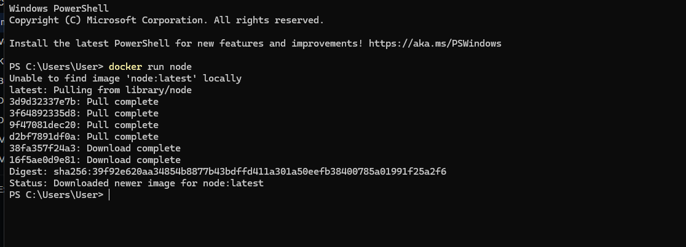
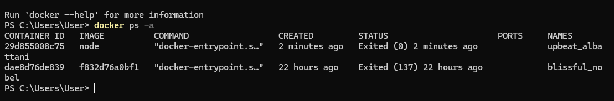
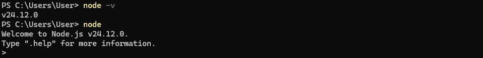
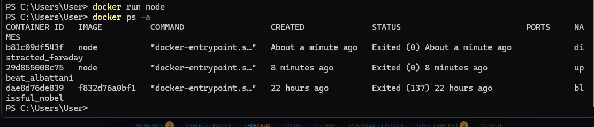
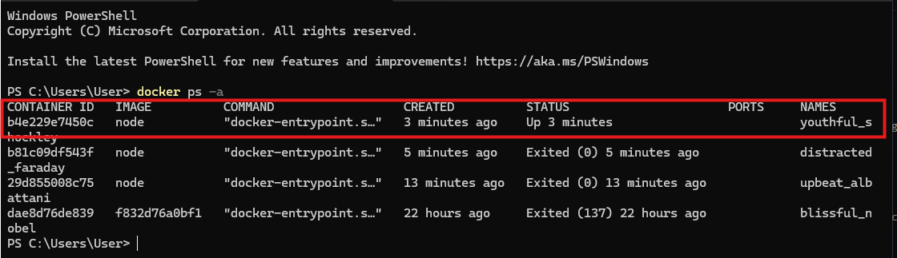
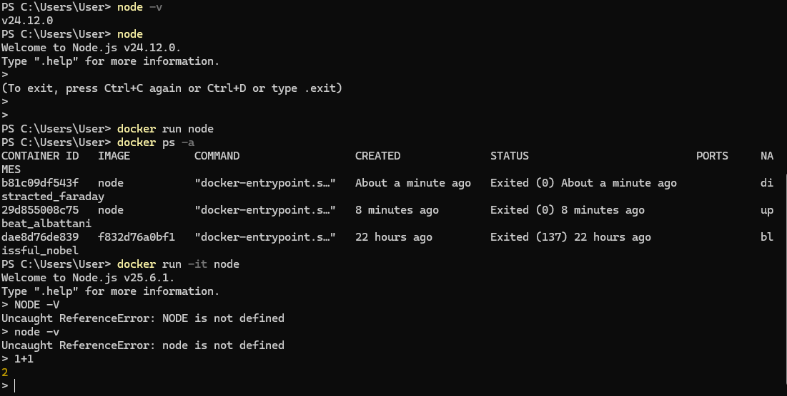
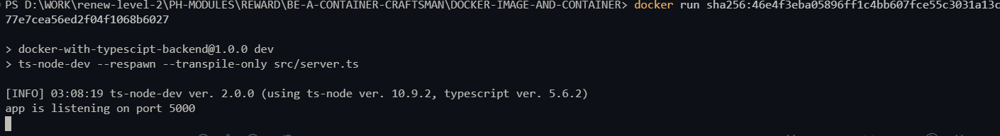
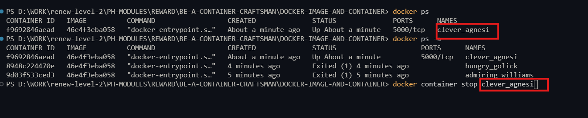

# DOCKER-IMAGE-AND-CONTAINER
Docker Cheat Sheet: https://find-saminravi99.notion.site/Docker-Cheat-Sheet-10dc48b8ac8c80b79f73ece2abfc6841?pvs=4

GitHub Link:
https://github.com/Apollo-Level2-Web-Dev/docker-with-typescript-backend/tree/module-2


## WSL Cheat Sheet

### **Checking WSL Installation**

1. **List Installed Distributions**:
    
    ```bash
    wsl --list --all
    
    ```
    
2. **List Running Distributions**:
    
    ```bash
    wsl --list --running
    
    ```
    
3. **Check Available Online Distributions**:
    
    ```bash
    wsl --list --online
    
    ```
    
4. **Check WSL Version**:
    
    ```bash
    wsl --list --verbose
    
    ```
    
5. **Check if WSL Feature is Enabled**:
    
    ```bash
    dism.exe /Online /Get-Feature /All | find "Microsoft-Windows-Subsystem-Linux"
    
    ```
    

### **Installing a New Distribution**

1. **Install a Distribution**:
(Replace `<distro-name>` with the name of the distribution, e.g., `Ubuntu`.)
    
    ```bash
    wsl --install -d <distro-name>
    
    ```
    

### **Uninstalling a Distribution**

1. **Unregister (Uninstall) a Distribution**:
    
    ```bash
    wsl --unregister <distro-name>
    
    ```
    
2. **Check for Remaining Files**:
    - Path: `C:\\Users\\<your-username>\\AppData\\Local\\Packages\\<distro-folder>\\LocalState\\`
    - Ensure no `.vhdx` files remain.

### **Uninstalling WSL Completely**

1. **Remove Installed Distributions**:
    - Go to **Settings** → **Apps** → **Apps & Features** and uninstall each distribution.
2. **Disable WSL Feature**:
    - Open **Windows Features** (`optionalfeatures.exe`).
    - Uncheck **Windows Subsystem for Linux** and **Virtual Machine Platform** (if applicable).
3. **Remove WSL Kernel Update**:
    - Go to **Settings** → **Apps** → **Apps & Features** and uninstall **Windows Subsystem for Linux Update**.

### **Starting WSL**

1. **Open a Distribution**:
    
    ```bash
    wsl -d <distro-name>
    
    ```
    
2. **Open from Start Menu**:
    - Search for the distribution (e.g., Debian, Ubuntu) in the Start Menu.

### **Logging Out of WSL**

1. **Logout Command**:
or
    
    ```bash
    exit
    
    ```
    
    ```bash
    logout
    
    ```
    

### **Terminating WSL**

1. **Terminate a Running Distribution**:
    
    ```bash
    wsl --terminate <distro-name>
    
    ```
    

### **Additional Tips**

- To update your WSL kernel manually, you can check [Microsoft's WSL documentation](https://docs.microsoft.com/en-us/windows/wsl/install) for the latest version.

---


# Docker Cheat Sheet

### **Getting Started with Docker**

1. **Check Docker Installation**:
    
    ```bash
    docker --version
    
    ```
    

### **Basic Commands**

1. **Pull an Image from Docker Hub**:
    
    ```bash
    docker pull <image-name>
    
    ```
    
    Example:
    
    ```bash
    docker pull ubuntu
    
    ```
    
2. **List Available Images**:
    
    ```bash
    docker images
    
    ```
    
3. **Run a Container**:
    
    ```bash
    docker run -it <image-name>
    
    ```
    
    Example:
    
    ```bash
    docker run -it ubuntu
    
    ```
    
4. **Run a Container in Detached Mode**:
    
    ```bash
    docker run -d <image-name>
    
    ```
    
5. **Stop a Running Container**:
    
    ```bash
    docker stop <container-id>
    
    ```
    
6. **Start a Stopped Container**:
    
    ```bash
    docker start <container-id>
    
    ```
    
7. **Remove a Stopped Container**:
    
    ```bash
    docker rm <container-id>
    
    ```
    
8. **Remove an Image**:
    
    ```bash
    docker rmi <image-name>
    
    ```
    

### **Managing Containers**

1. **List Running Containers**:
    
    ```bash
    docker ps
    
    ```
    
2. **List All Containers (including stopped)**:
    
    ```bash
    docker ps -a
    
    ```
    
3. **View Container Logs**:
    
    ```bash
    docker logs <container-id>
    
    ```
    
4. **Execute a Command in a Running Container**:
    
    ```bash
    docker exec -it <container-id> <command>
    
    ```
    
    Example:
    
    ```bash
    docker exec -it <container-id> bash
    
    ```
    
5. **Inspect a Container**:
    
    ```bash
    docker inspect <container-id>
    
    ```
    

### **Networking**

1. **List Docker Networks**:
    
    ```bash
    docker network ls
    
    ```
    
2. **Create a New Network**:
    
    ```bash
    docker network create <network-name>
    
    ```
    
3. **Connect a Container to a Network**:
    
    ```bash
    docker network connect <network-name> <container-id>
    
    ```
    
4. **Disconnect a Container from a Network**:
    
    ```bash
    docker network disconnect <network-name> <container-id>
    
    ```
    

### **Volumes and Data Management**

1. **Create a Volume**:
    
    ```bash
    docker volume create <volume-name>
    
    ```
    
2. **List Volumes**:
    
    ```bash
    docker volume ls
    
    ```
    
3. **Remove a Volume**:
    
    ```bash
    docker volume rm <volume-name>
    
    ```
    
4. **Mount a Volume to a Container**:
    
    ```bash
    docker run -v <volume-name>:<container-path> <image-name>
    
    ```
    

### **Dockerfile and Building Images**

1. **Create a Dockerfile**:
Basic structure:
    
    ```
    FROM <base-image>
    MAINTAINER <your-name>
    COPY <source> <destination>
    RUN <command>
    CMD ["<executable>"]
    
    ```
    
2. **Build an Image from a Dockerfile**:
    
    ```bash
    docker build -t <image-name>:<tag> .
    
    ```
    
    Example:
    
    ```bash
    docker build -t myapp:latest .
    
    ```
    
3. **List Built Images**:
    
    ```bash
    docker images
    
    ```
    

### **Advanced Commands**

1. **Tag an Image**:
    
    ```bash
    docker tag <image-id> <new-image-name>:<tag>
    
    ```
    
2. **Push an Image to Docker Hub**:
    
    ```bash
    docker push <image-name>:<tag>
    
    ```
    
3. **Save an Image to a Tar File**:
    
    ```bash
    docker save -o <path-to-output-file> <image-name>
    
    ```
    
4. **Load an Image from a Tar File**:
    
    ```bash
    docker load -i <path-to-input-file>
    
    ```
    
5. **Docker Compose**:
    - **Start Services**:
        
        ```bash
        docker-compose up
        
        ```
        
    - **Stop Services**:
        
        ```bash
        docker-compose down
        
        ```
        
6. **Scale Services**:
    
    ```bash
    docker-compose up --scale <service-name>=<number>
    
    ```
    
7. **View Running Docker Compose Services**:
    
    ```bash
    docker-compose ps
    
    ```
    

### **Useful Docker Commands**

1. **Remove All Stopped Containers**:
    
    ```bash
    docker container prune
    
    ```
    
2. **Remove Unused Images**:
    
    ```bash
    docker image prune
    
    ```
    
3. **Remove All Unused Data (containers, networks, images)**:
    
    ```bash
    docker system prune
    
    ```
    
4. **Get Docker System Information**:
    
    ```bash
    docker info
    
    ```


## 2-1 What is Images & Containers?

- While creating a project docker provides a container. By running the container we can run our project.we have already done a project and build an image 

### What is image? 
- Docker  gives us a container which means a unit of software which holds the codes and the environment for running the code. For running this container we need a blueprint. This blue print is called image. The image holds the codes and the environment. Using the same image we can run multiple container (create and manage). Suppose we have an image that we have built on node.js and this is a node.js project. we can create multiple container of this project and and run separately. We can share the exact container within team mate and it will work smoothly and show output.
-  **Interesting fact about the image is :**  The image is read only and we can not change the code. But when we create a container using the image we can do both read and write. Image is a static paper which is the blueprint. 

- The image is like a snapshot. using the image we can create container and run the container. 

## 2-2 Using Pre-built Images

- FOR CREATING CONTAINER WE WILL NEED IMAGE. WE CAN GET IMAGE IN **TWO WAYS** 
  1. Prebuilt image (might be coming from docker hub/ team mates) 
  2. Create Your Own Custom Image (write your own docker file based on another image)

- Now lets work with a prebuilt image first. 
-  lets got to docker hub and get the node image [docker hub node](https://hub.docker.com/_/node) , This is an official image of node. If wer want we can run this image in our own machine 

- open the power shell and tun the docker desktop and engine on. 

```shell
docker run node
```
- in power shell write this.
- This will first search time image locally. and if not found it will download the image from the hub. 

 

- for showing the running process we will write 


```shell
docker ps -a
```
- here `ps` means process and `-a` means all. 



- here we can see the node image container tried to run and exited immediately.

- we can run our locally installed node in our pc like operating using node . 

 

- if we want to do this similar kind of node operation in terminal using the image what we have grabbed right now. now lets do it 

```shell
docker run node
```

- This command will not act like earlier because the image is already downloaded and now it will run in a container 




- it has exited immediately. But we want to run the container and do some interactions like node. 

```shell
docker run -it node
```
- here `it` means interactive. it will be continuously running and we can do some interactions. but if it was a server we do not have to use `it` Because server will run until we close. as node is not a server it runs in `it`



- its up now 
- we can wo operations like node installed in our machine 



## 2-3 Writing Our First Dockerfile

- Basic project setup is done
- Now lets dockerize our own projects. for this we will need to build an image from the project. and then the image should be run in a container. 
- lets write a `docker file` in the root folder 

```Dockerfile
# Use Node.js 20 as the base image
# This means our container will run in a Node.js 20 environment
# Think of this like installing Node 20 on a fresh Linux machine
FROM node:20

# Set the working directory inside the container
# This tells Docker: "From now on, run all commands inside /app"
# It also creates the folder automatically if it does not exist
#
# Why important?
# - All files we copy will go here (unless we specify another path)
# - npm install will run inside this folder
# - Our project will live here
#
# Without WORKDIR, Docker would use root (/) which is messy
WORKDIR /app

# Copy only package.json first
# First "." = source (your local project folder)
# Second "." = destination inside container (current WORKDIR => /app)
#
# Why copy package.json first?
# Docker caching optimization:
# If dependencies don't change, Docker won't reinstall npm packages
COPY package.json .

# Install dependencies inside the container
# Runs inside /app because of WORKDIR
# Equivalent to:
# cd /app && npm install
RUN npm install

# Copy the rest of the project files into the container
#
# First "." = copy everything from current local folder
# Second "." = paste into current container folder (/app)
#
# So this means:
# Local project → /app inside container
COPY . .

# Expose port 5000
# This is just documentation for Docker
# It tells: "This app runs on port 5000 inside container"
# To access from outside we still need -p mapping
# we know the container is isolated so we need to connect through the port. basically we are telling docker that you expose through 5000 port to the pc 
EXPOSE 5000

# Default command when container starts after image
# Runs: npm run dev
# Example: starts Express dev server or Vite or Next.js dev mode
CMD ["npm", "run", "dev"]
# Its basically npm run dev which will run over container not while building the image
```


```shell
FROM node:20

COPY . /app
RUN cd /app && npm install
```

```shell
FROM node:20
WORKDIR /app
COPY . .
RUN npm install
```


- the flow is 

```
Start container
   ↓
Create /app
   ↓
Enter /app (WORKDIR)
   ↓
Copy package.json → /app
   ↓
npm install in /app
   ↓
Copy rest of files → /app
   ↓
Run app from the image
```

## 2-4 Building an Image & Running Container Based On Our Image

- now lets build a image from the docker file we have made 


```shell
docker build .
#  in the terminal 
```

- this is going to build an image of the docker and the `.` means the current directory. if the Dockerfile is in /src the the command will be `docker build ./src`

```shell

docker images
```

- in the terminal if we write this it will show the i9mages for the project 

```shell
 docker run -p 5000:5000 sha256:46e4f3eba05896ff1c4bb607fce55c3031a13c877e7cea56ed2f04f1068b6027
 ## left 5000 means external and right is internal
```
or 

```shell
docker run -p 5000:5000 46e4f3eba058
```


- this will run the project 

- show just the running containers 

```
docker ps
```

- show all the container available 

```
docker ps -a
```

- to stop the container 

```
docker container stop clever_agnesi
```




## 2-5 Deep Dive Into Docker Images

- Docker image is a read only file. If we change it will not reflect the changes. 
- Image builds one time so i is not gets automatically aware of the changes. we need to build again and start the container again
- Yes, this can be a problem, especially when we make frequent changes during development. Rebuilding the container every time can feel slow and inefficient.To solve this, Docker provides faster ways to connect with the container so that changes reflect immediately in the output. We’ll learn these techniques gradually (like volume mounting and live reload).Also, Docker uses a caching mechanism during builds. When rebuilding an image, Docker only rebuilds the layers that have changed. Any unchanged layers are reused from the cache. This makes the rebuild process much faster and more efficient.


```Dockerfile
# Use Node.js 20 as the base image
# This means our container will run in a Node.js 20 environment
# Think of this like installing Node 20 on a fresh Linux machine
FROM node:20

# Set the working directory inside the container
# This tells Docker: "From now on, run all commands inside /app"
# It also creates the folder automatically if it does not exist
#
# Why important?
# - All files we copy will go here (unless we specify another path)
# - npm install will run inside this folder
# - Our project will live here
#
# Without WORKDIR, Docker would use root (/) which is messy
WORKDIR /app

# Copy only package.json first
# First "." = source (your local project folder)
# Second "." = destination inside container (current WORKDIR => /app)
#
# Why copy package.json first?
# Docker caching optimization:
# If dependencies don't change, Docker won't reinstall npm packages
COPY package.json .

# Install dependencies inside the container
# Runs inside /app because of WORKDIR
# Equivalent to:
# cd /app && npm install
RUN npm install

# Copy the rest of the project files into the container
#
# First "." = copy everything from current local folder
# Second "." = paste into current container folder (/app)
#
# So this means:
# Local project → /app inside container
COPY . .

# Expose port 5000
# This is just documentation for Docker
# It tells: "This app runs on port 5000 inside container"
# To access from outside we still need -p mapping
# we know the container is isolated so we need to connect through the port. basically we are telling docker that you expose through 5000 port to the pc 
EXPOSE 5000

# Default command when container starts after image
# Runs: npm run dev
# Example: starts Express dev server or Vite or Next.js dev mode
CMD ["npm", "run", "dev"]
# Its basically npm run dev which will run over container not while building the image
```